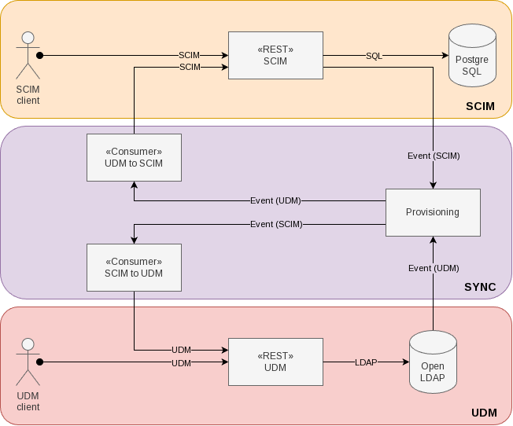
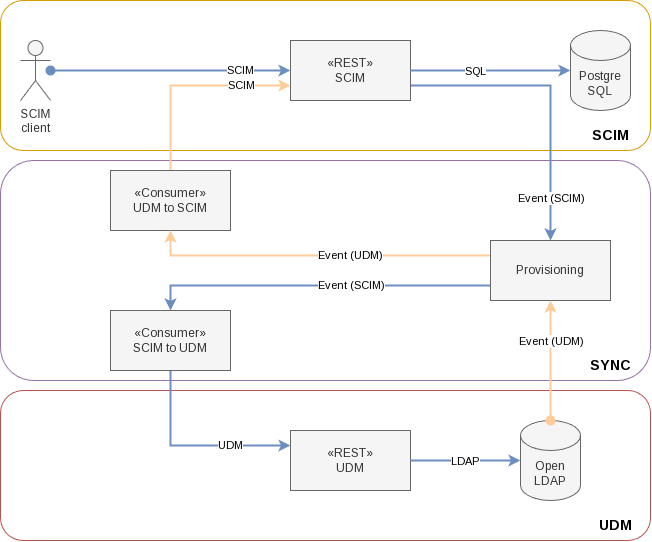
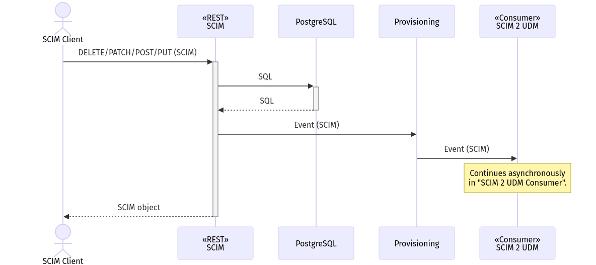

# Milestone 3: Asynchronous writes to UDM

[[_TOC_]]

## Goals

Goals of this development stage:

- Verification of the SCIM <-> UDM mapping.
- Verification of the UDM business rules implementation in the SCIM server.
- Performance tests measure the read and write performance change compared to MS2 and show the final performance.

## Result

- SCIM reads still go directly to the SCIM DB.
  - The SCIM service's availability and performance for read operations is independent of UDM.
- SCIM writes now go directly to the SCIM DB.
  - The SCIM service's availability and performance for write operations is independent of UDM.
- UDM business rules exist in _both_ UDM and SCIM server.
- There is no single source of truth anymore.
  - The SCIM and UDM REST APIs are independent services.
  - Changes to data model and business logic must be applied to _both_ services.
    - This raises the maintenance effort. To counter that, refactorings with the goal of a common code base should be evaluated.
- Changes done to SCIM are synchronized to the UDM DB asynchronously.
- Changes done to UDM are synchronized to the SCIM DB asynchronously.
- Errors encountered by either client are still logged,
  but now also sent to the Provisioning with realm `sync-error` and topic `scim2udm` or `udm2scim`,
  encoded as SCIM errors (see [RFC 7644 section 3.12](https://datatracker.ietf.org/doc/html/rfc7644#section-3.12)).
- Data in the SCIM and UDM databases is _eventually_ consistent.
- The UDM REST API and SCIM API use the same backend for locking during the creation of globally unique values
  like usernames and email addresses.
  - If we were to implement a locking mechanism today, we wouldn't use UDM or LDAP.
    They are too slow, lack atomic functions and automatic cleanup.
    Redis, etcd and memcached come to mind.
  - We split a decision about a new locking backend from the implementation of the SCIM service and
    start with the existing one in UDM.
    Its code should be extracted from UDM and moved into a Python library that will be used by SCIM and UDM.
- Performance tests show an excellent performance.
  - Read performance unchanged from MS1.
  - Write performance is almost back to that of MS1.
    - Difference is time needed by the business rules in the SCIM server.
  - Measure SCIM <-> UDM database synchronization delay.
    - Delay is the write performance of MS2 (in the respective direction) plus the delay of the Provisioning stack.
    - The delay of the Provisioning stack from SCIM to UDM is lower (single digit ms) than from UDM to SCIM,
      because SCIM events do not need to be processed by the UDM Transformer.

## Concurrent write conflict resolution using attribute-level comparisons

There are situations in which the same object is changed "simultaneously" by a UDM and a SCIM client.
"Simultaneous" in this context means that both objects are changed, before they are synchronized.

Example: The object "A" exists in UDM and SCIM.
When it is changed in the UDM DB, an event is sent, so the modification is also applied to "A" in the SCIM DB.
But before that happens, the object "A" is changed in the SCIM DB by a SCIM client.

If we'd decided on an object level which change to accept, we'd lose one change.
In the above example we'd lose the UDM change, because we'd keep the newer SCIM object.

### Simultaneous updates

Although we don't have versioned attributes, we can still do a finer-grained synchronization:
UDM and SCIM change events contain the previous ("old") and the "new" state of an object, including the attributes.
We can calculate the "difference": The attributes that changed in the source object (in the example UDM).
Then we overwrite only those changed attributes on the target object (in the example SCIM).

This "delta" synchronization mode handles all update situations safely except for one:
The same attribute was changed on the same object "simultaneously" in UDM and SCIM.

- Very unlikely, because most attributes are written by only one application,
  and that application won't use both interfaces (SCIM and UDM).
- The situation won't be detected.
  An automatic conflict resolution is not possible.
  The value from the last or slowest object to synchronize will overwrite the other.

#### Handling multi-value fields

Multi-value fields (attributes where the value is a list of values) must be handled by applying changes,
instead of overwriting the whole attribute.

That means, that an update of a multi-value field is done in two steps:

1. Removing items from the list on the target attribute that were removed from the "old" attribute (compared to "new").
2. Adding items to the list on the target attribute that were added to the "new" attribute (compared to "old").

### Simultaneous creations

If we want, the "delta" synchronization mode can handle the following situation automatically.
But maybe we want to interpret the situation as a conflict the operator has to handle.
**→ Needs discussion.**

Two objects with the same values in attributes with uniqueness constraints can be created "simultaneously" by SCIM and UDM,
e.g. a user or a group with the same name.
(The same UUID is statistically improbable.)

- Very unlikely, because the provisioning of users and groups usually follows the organizational requirements of the customer,
  with only one "input channel" for identities (UCS@school import, AD Connector, interactively).
  Event when multiple channel are used, the user sets usually don't overlap
  (e.g. teachers come from the AD, students come from a UCS@school import).
- It is more likely to happen for groups than for users.
- When a "simultaneous" creation happens, it can be detected.
  An automatic conflict resolution is possible, but may not be desirable.
  My proposal (see "Sequence diagram: UDM 2 SCIM Client") is an "optimistic" resolution:
  When the synchronization code detects an existing object, it updates it.
  Reasoning: Using the same identifier (name) for an object usually means it's the same object.
- There is a corner case that cannot (and IMHO should not) be solved automatically:
  Objects with multiple uniqueness constraints (e.g. `username` and `mailPrimaryAddress`) with differing values.
  Reasoning: This is a clear indicator of an organizational error (e.g. parallel imports with different configurations).

## Concurrent write conflict resolution using attribute-level comparisons

Please see section of same name in [Milestone 2: Synchronous writes to UDM, reads from SQL](milestone2.md).
The only difference in MS3 is, that this must now also happen in the _SCIM 2 UDM Client_.

## Handling password (hashes)

Questions:

- How can we handle the clear text password with asynchronous interaction with UDM?
  - Store it in the event?
  - Or make the call synchronous?
  - ...

- How can we handle passwords which do not match the given complexity policies?
  - Copy code from UDM?
  - Make a synchronous call to UDM?
  - Extract password policy handling from UDM into dedicated RPC service?

## Components overview

## Sequence diagram: Reading from SCIM REST API

: Reading from SCIM REST API")

## Writing to SCIM REST API

### Components

### Sequence diagram

## Writing to UDM REST API

### Components

")

### Sequence diagram

: Writing to UDM REST API")

## Sequence diagram: UDM 2 SCIM Client

: UDM 2 SCIM Client")

## Sequence diagram: SCIM 2 UDM Client

: SCIM 2 UDM Client")

## Authentication

Unchanged from MS1:

- The SCIM database's connection settings are read from the environment.
  Secrets (passwords, certificates etc.) are read from files whose paths are in environment variables.

Unchanged from MS2:

- To use the SCIM REST API the client must send an OAuth token with the request.
  - A certificate to verify the OAuth tokens is provided as a (bind mounted) file.
  - The path to the certificate file can be read from an environment variable.
- The user in the token must exist in the SCIM database.
- The user must be member of a certain group in the SCIM DB.
  - The groups name is configurable through an environment variable and defaults to `scim-clients`.
- The user should exist in UDM/LDAP and will be created in the SCIM DB by the UDM 2 SCIM Client.
- The SCIM server's container offers a CLI to create-or-update users and groups in the SCIM database.
  - This can be used for testing without an associated user synchronized from UDM.
  - This must be used to create the user that the UDM 2 SCIM Client uses.
- The UDM 2 SCIM Client reads the SCIM REST API's connection settings from the environment.
  Secrets (passwords, certificates etc.) are read from files whose paths are in environment variables.

Changed from MS2:

- The SCIM REST server _doesn't_ read the UDM REST API's connection settings anymore.

New:

- The SCIM 2 UDM Client reads the UDM REST API's connection settings from the environment.
  Secrets (passwords, certificates etc.) are read from files whose paths are in environment variables.
  - The LDAP account (the "bind dn") is configurable.
  - As BSI base security expects the password to be rotated, the `cn=admin` account shouldn't be used.
    Thus, a dedicated service account should be created.
  - For performance reasons, the account should profit from permissive LDAP ACLs.

## Authorization

Unchanged from MS1:

- Restrictions defined in the SCIM RFCs apply (e.g., the `id` field is read-only).

Changed from MS2:

- Restrictions in the UDM data model and business logic apply,
  when changes are forwarded _asynchronously_ by the SCIM 2 UDM Client.
  - UDM REST API error messages are logged and sent to the Provisioning.

New:

- Restrictions in the UDM data model and business logic apply,
  when changes are verified by the SCIM server,
  as UDMs business logic has been copied into the SCIM service.

## Deliverables

No change to MS2.

## Navigation

- Previous chapter: [Milestone 2: Synchronous writes to UDM, reads from SQL](milestone2.md)
