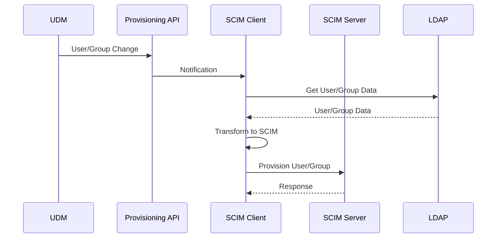

# SCIM Client

## Purpose

The SCIM client is a component that connects to a SCIM-compliant service provider to provision users and groups. It acts as a bridge between the Nubus environment and other systems that support the SCIM standard.

## Status

**Experimental:** This component is currently experimental and intended for preliminary testing only. It is not yet recommended for production use.

## Limitations

- **Lack of Configurability:** The SCIM client currently has limited configuration options.
- **External ID:** The target SCIM server must be configured to handle the `externalId` attribute for mapping users and groups.

## Known Issues

There are no known issues at this time.

## How to Execute

To run the SCIM client, you need to deploy it using the provided Helm chart. See the installation guide for more details.

## How to Execute Tests

The tests running agains the SCIM server from

```bash
docker compose --profile develop up --build --remove-orphans -d

docker compose --profile develop run --rm --build --remove-orphans test
# or
pytest -v -s ./
# or without active venv
uv run pytest -v -s ./

docker compose --profile develop down --volumes
```

To run the tests against the Univention SCIM server

```bash
docker compose --profile test-integration up -d --remove-orphans --build

docker compose --profile test-integration run --rm --build --remove-orphans test-integration
# or
UNIVENTION_SCIM_SERVER=true pytest -v -s ./
# or without active venv
UNIVENTION_SCIM_SERVER=true uv run pytest -v -s ./

docker compose --profile test-integration down --volumes
```

## Interfaces

The SCIM client interacts with the following systems:

- **SCIM Service Provider:** The target server to which users and groups are provisioned.
- **Nubus Provisioning API:** Used to subscribe to user and group changes in the Nubus environment.
- **LDAP:** Used to retrieve user and group information.

## Dependencies

The SCIM client depends on the following services:

- A running Nubus for Kubernetes instance.
- A SCIM-compliant service provider.
- Nubus Provisioning API.
- LDAP server.

## Architecture

The SCIM client is a listener module that subscribes to object changes in the Univention Directory Manager (UDM). When a user or group is created, updated, or deleted in UDM, the Provisioning API sends a notification to the SCIM client. The SCIM client then transforms the UDM data into the SCIM format and sends it to the target SCIM service provider.


